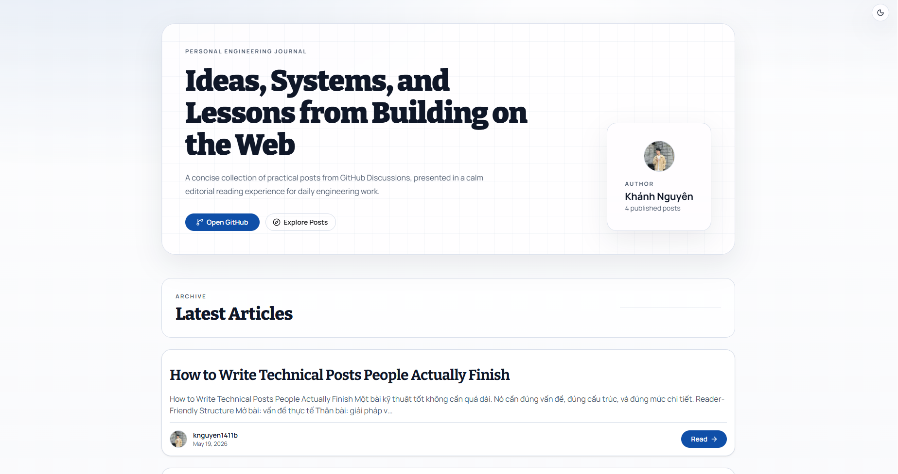

# My Blog

Editorial blog platform powered by **Next.js App Router** and **GitHub Discussions**.



> [!TIP]
> This project reads content directly from GitHub Discussions, so you only need a valid `GITHUB_TOKEN` to run it.

## Highlights

- Editorial-style UI with light/dark mode
- Blog list + blog detail pages with Markdown rendering
- Sticky table of contents with active section tracking
- Comments and replies rendered from Discussion API
- TanStack Query for client-side data fetching and caching
- HeroUI + Tailwind CSS v4 UI system

## Tech Stack

- Next.js 16
- React 19
- TypeScript
- Tailwind CSS v4
- HeroUI
- TanStack Query
- lucide-react

## Quick Start

### 1. Install dependencies

```bash
pnpm install
```

### 2. Configure environment

Create `.env.local`:

```env
GITHUB_TOKEN=your_github_token
```

### 3. Run in development

```bash
pnpm dev
```

Open: `http://localhost:3000`

## Scripts

- `pnpm dev` - start development server
- `pnpm build` - production build
- `pnpm start` - run production server
- `pnpm lint` - run ESLint
- `pnpm lint:fix` - fix lint issues
- `pnpm format` - format code with Prettier
- `pnpm format:check` - verify formatting

## Project Structure

```text
app/
  api/                 # Route handlers for blogs and profile data
  [id]/                # Blog detail route
  globals.css          # Global design tokens and base styles
  layout.tsx           # Root layout and providers
  providers.tsx        # TanStack Query + theme providers
features/
  blog/                # Blog domain: hooks, components, services, types
  home/                # Home domain: hooks, components, services, types
components/            # Shared UI components
lib/                   # GraphQL, constants, and utility helpers
```

## CI and Code Quality

- GitHub Actions workflow: `.github/workflows/ci.yml`
- Prettier + ESLint configured
- Husky + lint-staged enabled for pre-commit checks

## Project Documents

- [Code of Conduct](CODE_OF_CONDUCT.md)
- [Contributing Guide](CONTRIBUTING.md)
- [Security Policy](SECURITY.md)
